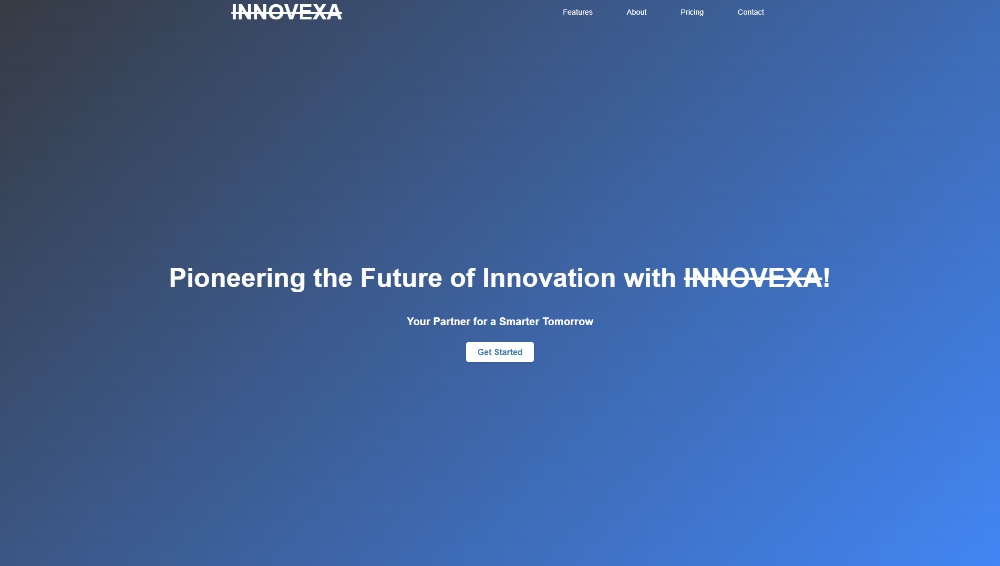
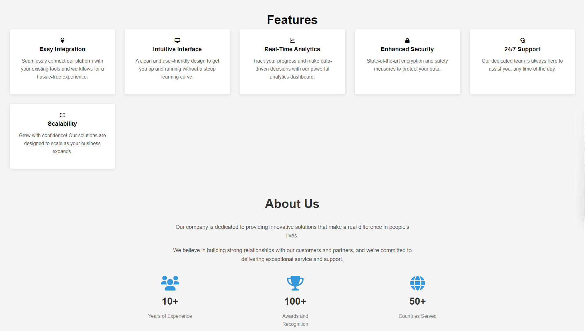
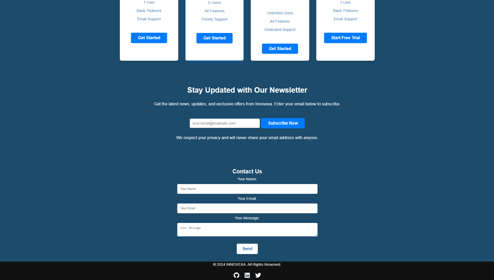

# <s>Innovexa</s> Landing Page 🚀

This is a modern and responsive landing page created for **Innovexa**, a brand aimed at delivering innovative solutions for a smarter future. The page is designed to showcase the brand's mission, features, and offerings while ensuring an engaging user experience.

---

## Features 🌟

- **Hero Section**: Eye-catching header with a compelling tagline and a call-to-action button.
- **Responsive Design**: Fully responsive across all devices (mobile, tablet, desktop).
- **Navigation Bar**: Sticky navigation bar with smooth scroll functionality.
- **Pricing Section**: Clearly defined pricing plans to cater to different user needs.
- **Subscription Section**: An easy-to-use form for users to subscribe to updates.
- **Footer**: Includes social media links and copyright information.

---

## Technologies Used 🛠️

- **HTML5**: For structuring the content.
- **CSS3**: For styling and animations.
- **JavaScript (Optional)**: For enhancing interactivity (if applicable).
- **Font Awesome**: For social media icons in the footer.

---

## Installation and Usage 🚀

1. Clone the repository:
   ```bash
   git clone https://github.com/CornHaki/CodSoft_Task_2.git
2. Navigate to the project directory:
   ```bash
   cd CodSoft_Task_2
3. Open the ```index.html``` file in your browser.
   ```bash
   open index.html
   
---

## Screenshots 📸





---

## *📂 Folder Structure*
```plaintext
project-directory/
└── assets/
│      ├── image1.png
│      ├── image2.png
│      ├── image3.png
│      └── image4.png
├── README.md           # Project description and details
├── favicon-32x32.png 
├── index.html          # Main HTML file
├── script.js           # JavaScript file for calculator logic
└── styles.css          # CSS file for styling


```

## Author 🖋️
Dimpal Baishya
---

## *📬 Contact Me*
Feel free to connect with me:

📧 Email: baishyadimpal31@gmail.com
---
